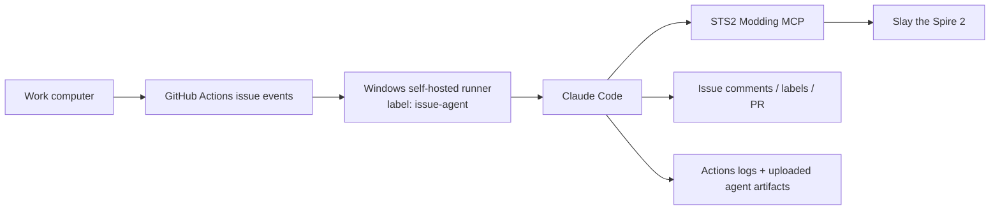

# Azure VMSS Worker Bootstrap

This document is the current VMSS direction after removing the old queue-worker and bridge-request architecture.

## Goal

Build Windows workers that can:

- run GitHub Actions jobs
- launch Claude Code headlessly
- use the STS2 Modding MCP server directly
- support remote visibility through Actions logs and uploaded artifacts

## Target Topology

GitHub Actions is the queue. There is no repo-owned queue worker or scheduled task layer in this model.

## Worker Image Requirements

Each worker image should already contain:

- Steam
- Slay the Spire 2
- GitHub Actions runner
- Git
- GitHub CLI
- .NET 9 SDK
- Python 3.12
- Claude Code installed at `D:\automation\claude-code`
- STS2 Modding MCP installed at `D:\repos\sts2-modding-mcp`

Recommended stable paths:

- `D:\repos\card-utility-stats`
- `D:\repos\sts2-modding-mcp`
- `D:\SteamLibrary\steamapps\common\Slay the Spire 2`
- `D:\automation\claude-code`

## Runner Labels

For the current issue-agent model, the important label is:

- `issue-agent`

That label now means "runner that can process one issue-agent job."

## Auth

The runner should be able to:

- use Azure OIDC through GitHub Actions
- read Azure Key Vault secret `card-utility-stats`
- expose that secret to Claude Code as `ANTHROPIC_API_KEY`

## Validation

Minimum validation checklist for a new VMSS node:

1. runner comes online with `self-hosted`, `windows`, and `issue-agent`
2. `.mcp.json` exists in the repo checkout
3. `claude.exe mcp list` shows `sts2-modding`
4. STS2 MCP bridge ports are reachable when the game is running
5. a test issue-agent run uploads:
   - `claude-issue-agent-events.jsonl`
   - `claude-issue-agent-summary.log`
   - `claude-issue-agent-debug.log`

## Current Status

The builder path has now been proven far enough to freeze a first reusable
image:

- the standalone Azure builder VM was prepared by hand with Steam login, STS2
  install, first launch, and Steam offline mode confirmation
- the repo-side WinRM and private Ansible workflows both completed successfully
  against that builder
- a specialized Azure Compute Gallery image was captured from the prepared
  builder as:
  - gallery: `cardutilitystatsdevgallery`
  - image definition: `issue-agent-specialized`
  - image version: `1.0.0`
- the image-backed VMSS config now lives at:
  - [infra/opentofu/azure-vmss/romaine-life-specialized.tfvars](../../../infra/opentofu/azure-vmss/romaine-life-specialized.tfvars)
- the OpenTofu workflow now plans that config cleanly with exactly one VMSS
  resource to add

That repo-side runner-registration gap is now implemented:

- [infra/opentofu/azure-vmss/main.tf](../../../infra/opentofu/azure-vmss/main.tf)
  grants the VMSS managed identity `Key Vault Secrets User` on the shared Key
  Vault and attaches a VMSS custom-script extension
- [ops/windows-worker/Initialize-IssueAgentRunner.ps1](../../../ops/windows-worker/Initialize-IssueAgentRunner.ps1)
  uses that managed identity to read the `github-pat` secret, then configures
  `D:\actions-runner` as a Windows service-backed repository runner
- [infra/opentofu/azure-vmss/romaine-life-specialized.tfvars](../../../infra/opentofu/azure-vmss/romaine-life-specialized.tfvars)
  now enables explicit NAT egress and the first-boot runner bootstrap path

The next operational step is no longer "write the bootstrap." It is:

1. apply the specialized VMSS config
2. confirm a new self-hosted runner comes online with labels including
   `issue-agent`
3. dispatch a real issue-agent workflow run against that runner

## Ansible Layer

Guest configuration should now be authored in:

- [infra/ansible/README.md](../../../infra/ansible/README.md)

The intent is:

1. create the standalone builder VM on the target SKU
2. run the first-touch bootstrap automation:
   - [.github/workflows/bootstrap-azure-builder-winrm.yml](../../../.github/workflows/bootstrap-azure-builder-winrm.yml)
3. that workflow enables WinRM on the VM with:
   - [ops/windows-worker/Enable-AnsibleWinRm.ps1](../../../ops/windows-worker/Enable-AnsibleWinRm.ps1)
4. stand up the private Linux control node in AKS:
   - [.github/workflows/deploy-aks-ansible-control-runner.yml](../../../.github/workflows/deploy-aks-ansible-control-runner.yml)
5. run the first real builder bootstrap pass over private WinRM:
   - [.github/workflows/bootstrap-azure-builder-ansible.yml](../../../.github/workflows/bootstrap-azure-builder-ansible.yml)
6. iterate on the Windows worker setup through Ansible against the builder VM
7. once stable, capture the golden image
8. reuse that same Ansible source of truth for VMSS instance setup later

Important boundary:

- Ansible is the guest-configuration source of truth
- the Windows guest should not be treated as the Ansible control node
- use a Linux control node that can reach the builder or worker over private WinRM
- GitHub-hosted runners are a good fit for the builder VM first-touch bootstrap, but not for the private Ansible execution path
- the ARC runner scale set `ansible-control` is the intended GitHub Actions `runs-on` target for the builder bootstrap workflow

See [docs/aks-ansible-control-node.md](../../../docs/aks-ansible-control-node.md) for the runner deployment inputs, secret names, and builder-bootstrap workflow contract.

Manual builder steps still expected for now:

- Steam login
- Slay the Spire 2 installation
- first-launch confirmation
- Steam offline mode confirmation

## What Was Removed

This VMSS direction no longer depends on:

- queue-worker scheduled tasks
- repo-managed scenario manifests
- worker-local live-driver scripts
- filesystem bridge request directories
- in-game `active-request.json` automation
